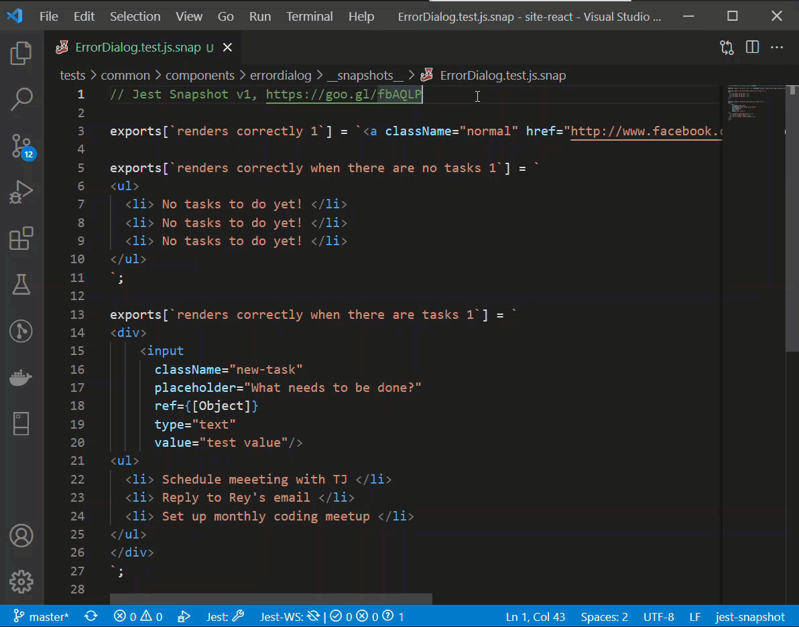

# test-snapshot-viewer

This extension extracts the test name and snapshot (which is HTML markup of a component, for example snapshot of a react component) and displays them in a new tab. The snapshot file is a *.snap file generated by the jest when writing the snapshot tests.

## Features

Open the snapshot file and (`Ctrl+Shift+P` or `Cmd+Shift+P`)> Snapshot: View Snapshot. A new tab will open with the rendered snapshot. The rendered snapshot has no styling.

## Release Notes

### 0.0.1
 
Added command to create a new tab that displays the snapshot.